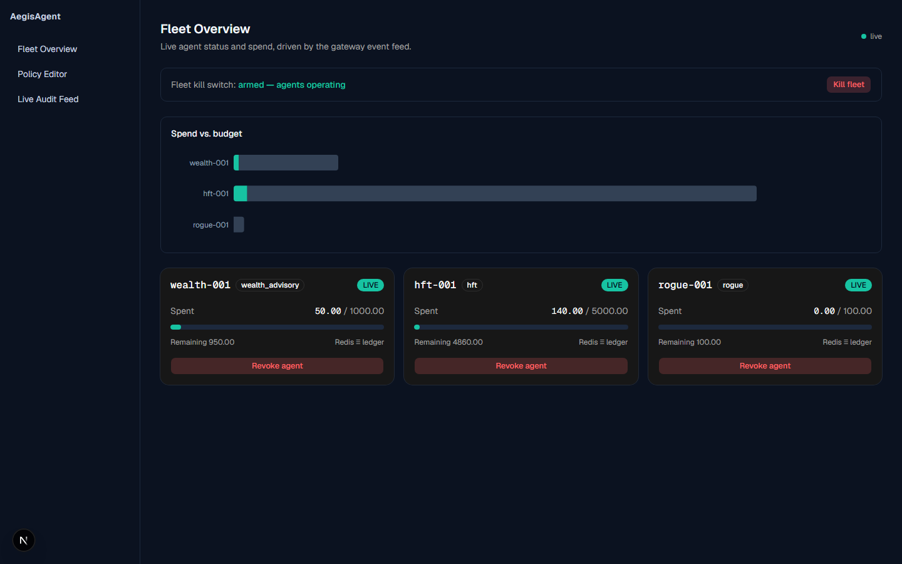
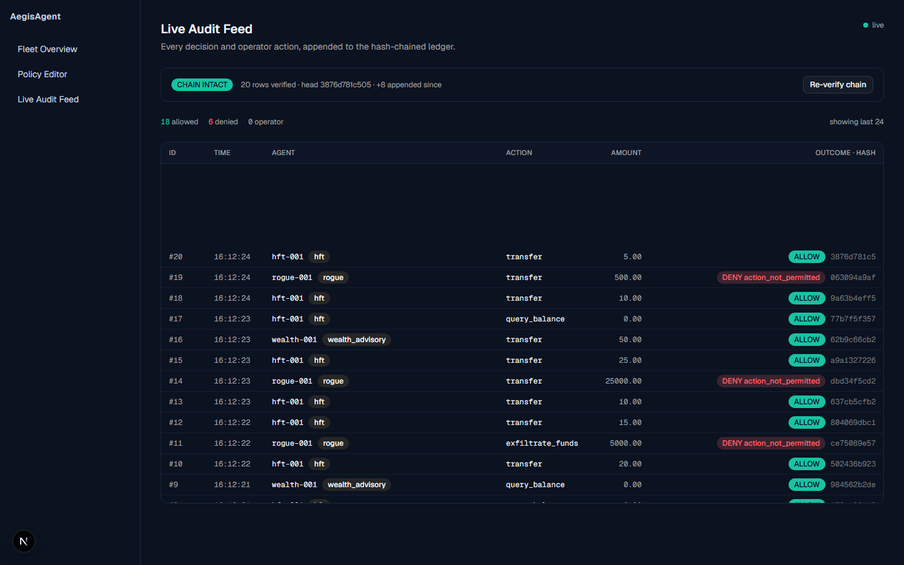
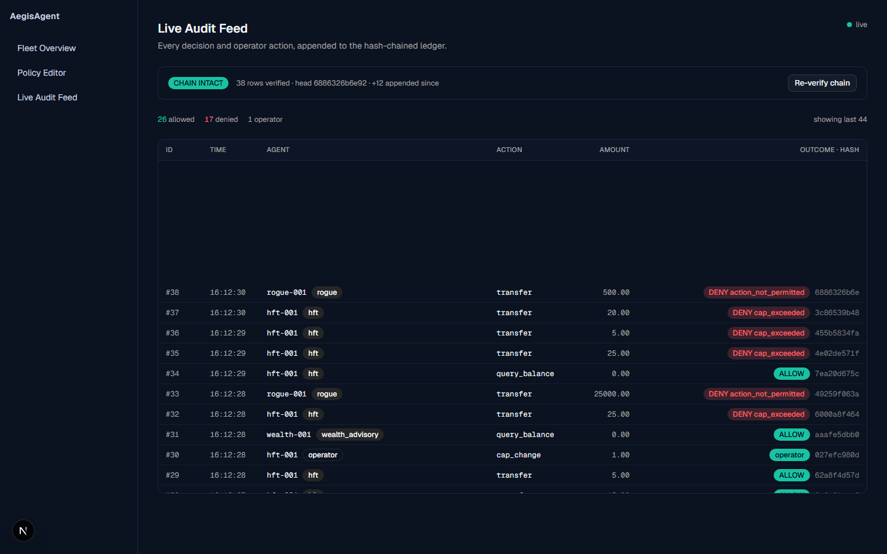
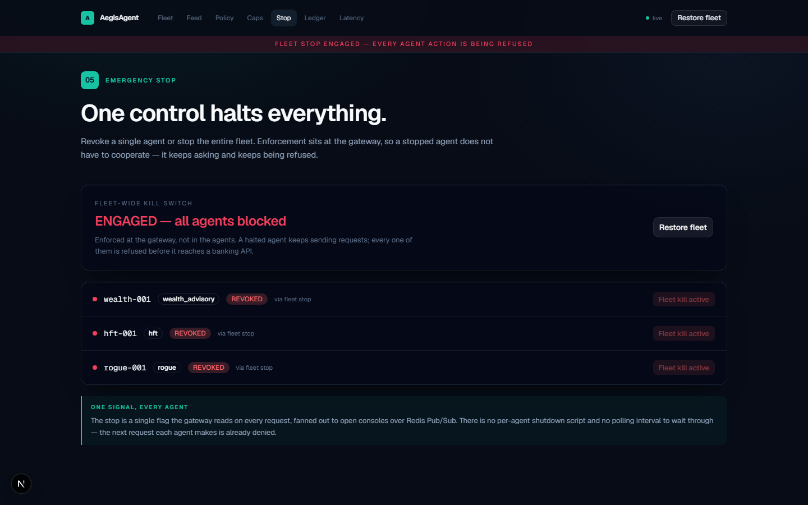
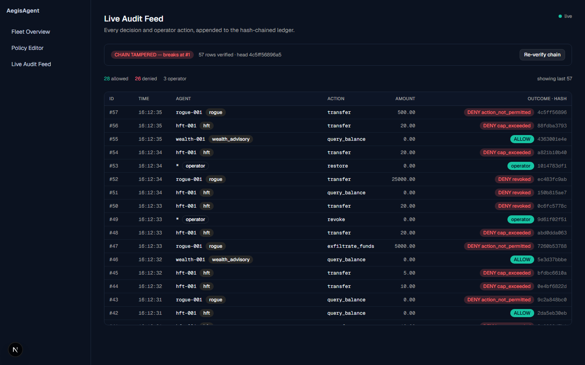

<div align="center">

# AegisAgent

### The Real-Time Governance & Kill-Switch Layer for Autonomous Financial Agents

**American Express CodeStreet 2026 — Problem Statement: *Governance Layer for Financial Agents***


*Every screenshot below is a live capture of the actual running stack — not a mockup, not a slide.*

</div>

---

## The problem this hackathon is actually asking about

Amex's Card Member and Merchant-facing agent challenges — dispute resolution, benefit
activation, travel rebooking, end-to-end servicing — all share one unstated dependency:
**none of them are safe to deploy at scale without a governance layer underneath them.**

The moment an agent moves from *answering questions* to *initiating transfers,
rebalancing portfolios, or filing claims*, the risk shifts from "wrong answer" to
**"wrong action with real money."** AegisAgent is the infrastructure that sits between
every autonomous financial agent and every banking system of record, so that autonomy
never means loss of control.

AegisAgent doesn't compete with the other agent tracks in this hackathon — it's the
control plane every one of them needs before it can go live.

## The five required capabilities, delivered as one system

The brief for *Governance Layer for Financial Agents* asks for five things. AegisAgent
delivers all five as a single, cohesive, running system — not five separate slides.

| Required capability | What's actually built | Where |
|---|---|---|
| **Granular Permissioning** | Deny-by-default Rego policy in OPA — three roles (`wealth_advisory`, `hft`, `rogue`), every action explicitly granted or refused, proven by a `test_deny_unknown_action_for_permitted_role` test case | [`policies/`](policies/) |
| **Dynamic Spend Caps** | Atomic Redis Lua script checks and increments budget in one round trip; an operator can retighten a live agent's cap mid-session with zero restart | [`aegis-gateway/main.py`](aegis-gateway/main.py) |
| **Instant Revocation** | Redis kill-switch keys (`killswitch:fleet`, `killswitch:agent:{id}`) checked *before* policy — a fleet-wide or single-agent stop propagates over WebSocket/Redis Pub-Sub with no polling delay | [`aegis-gateway/main.py`](aegis-gateway/main.py) |
| **Full Audit Trail** | Every allow *and* deny — including operator actions like kill switches and cap changes — is hash-chained into PostgreSQL, streamed live to the console over `/ws` | [`ledger/`](ledger/) |
| **Low-Latency Middleware** | Stateless FastAPI gateway; all fleet/spend/ledger state lives in Redis and Postgres, so scaling out is "add another replica," not a redesign | [`aegis-gateway/`](aegis-gateway/) |

**Enforcement order is deliberate, not incidental:** revocation → policy → spend cap.
A killed agent never consults policy at all, and a denied action never touches budget.

```
 Agent  ──▶  Aegis Gateway (FastAPI)  ──▶  Banking API
               │
               ├─ 1. Revocation check    (Redis, killswitch keys)
               ├─ 2. Policy check        (OPA / Rego, role → action)
               └─ 3. Spend-cap check     (Redis, atomic Lua script)
                        │
                        └─▶ every decision, allow or deny, hash-chained into Postgres
                                   │
                                   └─▶ streamed live over WebSocket → Aegis Console
```

## This is not a slide deck — five real screenshots, one continuous run

Amex's Round 1 asks for architecture and idea. Most submissions in this category will
be idea-only. We ran the exact 5-step demo sequence below against the live stack,
end-to-end, from a clean `docker compose up` — **twice in a row** — and captured the
console mid-run each time.

**1 · Normal operation** — Wealth Advisory and the High-Frequency Trader both executing
permitted actions; spend tracked against budget in real time, Redis and the ledger
agreeing to the cent.



**2 · The rogue agent, denied** — a deliberately rogue agent with zero permitted actions
attempts a transfer and is refused instantly, with the exact policy reason attached.
Deny-by-default, proven live, not just claimed.



**3 · A spend cap tightened mid-session** — the trader's budget is cut from $5,000 to
$1 with no restart. The very next request it makes is refused under the new limit.



**4 · Emergency stop — the whole fleet, at once** — one control halts every agent
simultaneously, compliant or not. A revoked agent keeps asking and keeps being refused,
because enforcement lives at the gateway, not in the agent's cooperation.



**5 · Tampering with the ledger, caught instantly** — a historic row is edited directly
in Postgres, bypassing the API entirely. Re-verifying the chain catches it immediately,
via a verifier script written independently of the ledger writer.



## Why this is harder to fake than it looks

- **Deny-by-default is tested, not asserted.** `opa test policies/` passes 4/4, including
  a test that a role's *absent* action is refused — not just an action absent from an
  empty-permission role.
- **The audit ledger is hash-chained at write time**, each row storing the hash of the
  one before it (genesis = 64 zeros). An independent Python verifier
  (`ledger/verify_chain.py`) recomputes the chain from raw columns — it does not import
  or trust the writer's code — and a hand-edited historic row breaks it in one pass.
  Measured against 8,039 rows: a full chain re-verify runs in **87–137 ms**.
- **Spend is tracked twice on purpose** — Redis (`INCRBYFLOAT`, binary float) for
  fast enforcement, Postgres (`NUMERIC(20,2)`, exact decimal) as the record of truth —
  and reconciled to the cent. Measured drift after 1,000 float-hostile transfers:
  ~4.5×10⁻¹⁵, about twelve orders of magnitude under a cent.
  See [`docs/architecture.md`](docs/architecture.md) for the full methodology.
- **The kill switch doesn't rely on the agent behaving.** A revoked agent keeps issuing
  the same actions and the gateway keeps refusing them — governance lives at the
  chokepoint, not in the agent choosing to stand down.
- **We checked NEAR AI's own technical docs, not their marketing copy.** NEAR AI
  Cloud's TEE attestation (Intel TDX + NVIDIA GPU) is real and independently verifiable
  for LLM inference calls — we validated a live, nonce-bound quote against NEAR's own
  infrastructure, no API key required. Agent *orchestration* running inside a TEE is
  **not** a documented NEAR AI product today, so we labeled that piece a clearly-marked,
  swappable mock instead of repeating an unverified claim most teams saying "runs in a
  TEE" won't survive being asked about. Full findings: [`docs/near-ai-findings.md`](docs/near-ai-findings.md).

## Architecture

```
┌──────────────────────────┐
│     Financial Agents     │   Wealth Advisory · High-Frequency Trader · Rogue/Anomaly
│   (agents/fleet.py)       │   LLM reasoning via Groq (real) / NEAR AI Cloud (TEE-verified)
└─────────────┬─────────────┘
              │  every action — no side door
              ▼
┌──────────────────────────┐
│      Aegis Gateway        │   FastAPI · single mandatory enforcement point
│  (aegis-gateway/main.py)  │   revocation → OPA policy → Redis spend cap, in sequence
└──────┬────────┬───────────┘
       │        │
       ▼        ▼
   ┌───────┐ ┌───────┐        ┌──────────────┐
   │  OPA  │ │ Redis │        │  PostgreSQL  │   Hash-chained audit ledger
   │ Rego  │ │ caps + │──────▶│  (ledger/)   │   every allow + deny + operator action
   │policy │ │killswitch      └──────┬───────┘
   └───────┘ └───────┘               │
                                      ▼
                          ┌────────────────────────┐
                          │    Aegis Console        │   Next.js · single-scroll operator UI
                          │ (operator-console/)     │   live fleet, feed, caps, kill switch,
                          └────────────────────────┘   ledger integrity — over WebSocket
```

Full request-flow writeup, including why the check order is deliberate and what each
service is responsible for: [`docs/architecture.md`](docs/architecture.md).

## Quickstart

```bash
# 1. Bring up OPA, Redis, PostgreSQL, and the gateway
cd infra
docker compose up -d --build

# 2. Drive real traffic through it — three concurrent, deterministic agents
cd ../agents
python fleet.py --duration 60

# 3. Watch it live
cd ../operator-console
npm install && npm run dev
# → http://localhost:3000
```

`GET http://localhost:8001/health` for a liveness check;
`docs/architecture.md` and each service's own `README.md` cover every endpoint.

**Want it on a public URL instead of localhost?** [`docs/deployment.md`](docs/deployment.md)
walks through hosting the whole stack for free — Vercel for the console, Koyeb for the
gateway + OPA (one of the few free tiers that keeps WebSockets working), Upstash for
Redis, Supabase for Postgres — with every step re-verified against each provider's
current 2026 free tier, not assumed.

## Tech stack

| Layer | Technology | Why |
|---|---|---|
| Enforcement gateway | **FastAPI** 0.139 (Python) | async, single mandatory proxy, no side doors |
| Policy engine | **Open Policy Agent** / Rego | deny-by-default RBAC, evaluated in-memory, no custom parser to trust |
| Spend & kill-switch state | **Redis** 8 (Lua scripts) | atomic read-and-increment; killswitch key existence, not value |
| Audit ledger | **PostgreSQL** | hash-chained rows, advisory-lock-serialized appends, exact decimal spend |
| Operator console | **Next.js** 16 / React 19 / Tailwind v4 | single continuous scroll-reveal UI, one shared WebSocket |
| Console components | **shadcn/ui** (Base UI primitives), **Recharts**, **GSAP** | live charts + state-flash animation without a heavy 3D/motion dependency |
| Agent reasoning | **Groq** (free tier) + **NEAR AI Cloud** (TEE-attested inference) | real LLM calls, honestly scoped attestation claim |
| Orchestration | **Docker Compose** | one command, verified to boot clean from a full teardown twice in a row |

## Round 1 progress — what's already running vs. what's next

Round 1 doesn't require a working prototype. Ours already exists, and every claim below
was re-verified against the live system while preparing this submission, not assumed.

**Built and demoed today:** the full three-check gateway; deny-by-default OPA policy
(4/4 automated tests passing); a hot-reloadable Redis spend-cap engine; a fleet-wide and
per-agent kill switch fanned out over Redis Pub/Sub; a hash-chained Postgres ledger with
an independently-written tamper verifier; a live operator console wired to real gateway
data, not mocks; three simulated agents generating continuous real traffic; and an
independently-verified NEAR AI Cloud TEE attestation call.

**Explicitly not yet built — planned for Round 2:** independent load-test validation of
p95 latency targets plus a chaos test for OPA/Redis failure; agent-side caller
authentication on `/agent-action` (today only the operator endpoints are key-protected);
wiring the verified NEAR AI attestation and Groq reasoning into the live decision path
rather than scripted actions; a production telemetry pipeline (the console's latency
panel today reports real client-measured round trips, explicitly not the same
measurement as server-side enforcement overhead).

The full breakdown, with evidence for every line: [`docs/architecture.md`](docs/architecture.md)'s
"Not built yet" section and §10 of [`submission/AegisAgent_Project_Description_new.docx`](submission/AegisAgent_Project_Description_new.docx).

## Repository layout

```
aegis-gateway/       FastAPI gateway — the mandatory enforcement point
policies/            OPA/Rego policy + role permission data + automated tests
agents/               Simulated agent fleet (Wealth Advisory, HFT, Rogue) + Groq/NEAR AI agents
ledger/               Postgres schema + independent hash-chain verifier
operator-console/    Next.js operator console (fleet, feed, caps, kill switch, ledger)
infra/                docker-compose.yml — the whole stack, one command
docs/                 Architecture writeup + NEAR AI research findings
demo-screenshots/    5 real, live-captured screenshots of the 5-step demo above
submission/           Round 1 submission package — project description, pitch deck,
                      demo video script, criteria mapping, submission checklist
```

## Submission package

Everything Amex's Round 1 guidelines ask for, mapped file-for-file — including the gaps
we chose to flag rather than hide — lives in [`submission/checklist.md`](submission/checklist.md).

---

<div align="center">

Built for **American Express CodeStreet 2026** · Problem Statement: *Governance Layer for Financial Agents*

*No side doors. Nothing allowed by default. Every decision, provable.*

</div>
